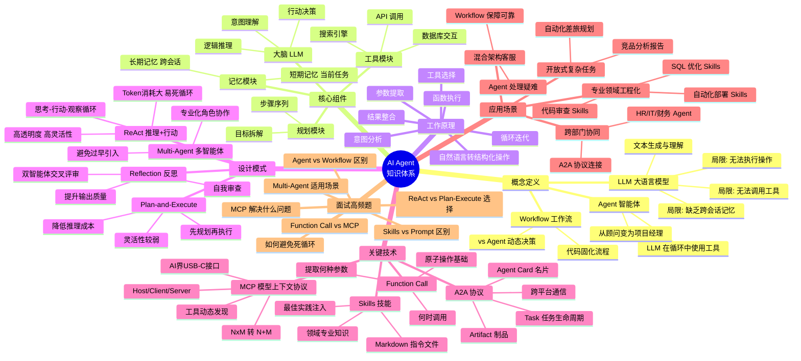
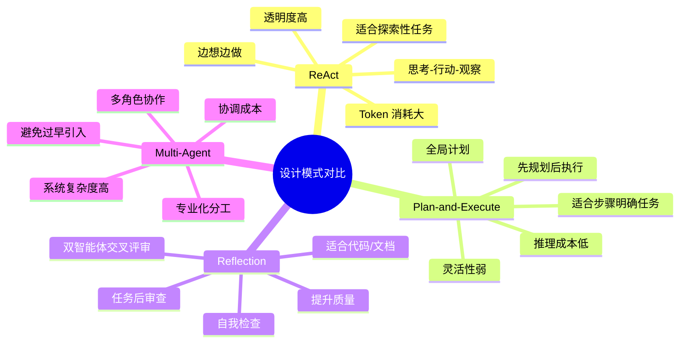
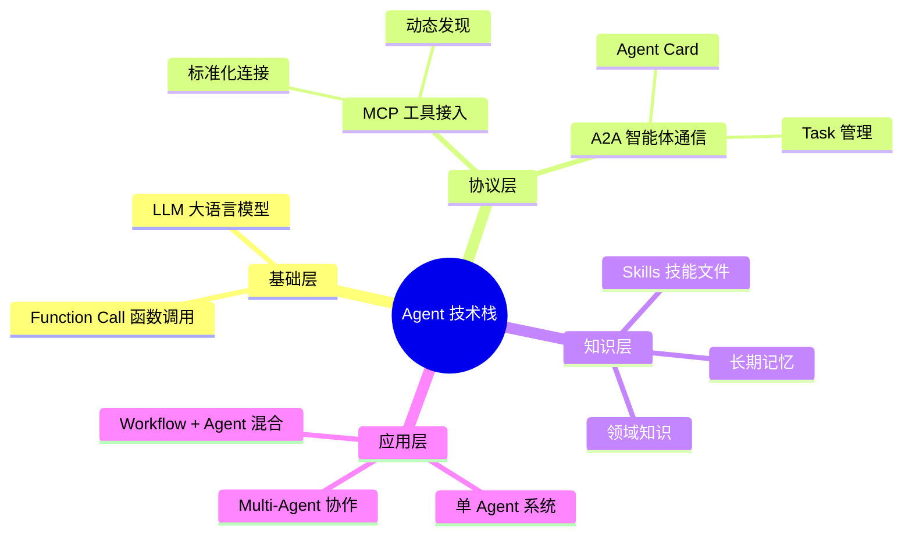

# AI Agent 面试知识脑图

> LLM Agent 概念、核心组件、设计模式、关键技术点全覆盖

## AI Agent 知识体系总览

```mermaid
mindmap
  root((AI Agent<br/>知识体系))
    概念定义
      LLM 大语言模型
        文本生成与理解
        局限: 无法执行操作
        局限: 缺乏跨会话记忆
        局限: 无法调用工具
      Agent 智能体
        LLM 在循环中使用工具
        从顾问变为项目经理
      Workflow 工作流
        代码固化流程
        vs Agent 动态决策
    核心组件
      大脑 LLM
        意图理解
        逻辑推理
        行动决策
      规划模块
        目标拆解
        步骤序列
      记忆模块
        短期记忆 当前任务
        长期记忆 跨会话
      工具模块
        API 调用
        数据库交互
        搜索引擎
    工作原理
      自然语言转结构化操作
      意图分析
      工具选择
      参数提取
      函数执行
      结果整合
      循环迭代
    设计模式
      ReAct 推理+行动
        思考-行动-观察循环
        高透明度 高灵活性
        Token消耗大 易死循环
      Plan-and-Execute
        先规划再执行
        降低推理成本
        灵活性较弱
      Reflection 反思
        自我审查
        双智能体交叉评审
        提升输出质量
      Multi-Agent 多智能体
        专业化角色协作
        避免过早引入
    关键技术
      Function Call
        何时调用
        提取何种参数
        原子操作基础
      MCP 模型上下文协议
        AI界USB-C接口
        Host/Client/Server
        NxM 转 N+M
        工具动态发现
      Skills 技能
        Markdown 指令文件
        领域专业知识
        最佳实践注入
      A2A 协议
        Agent Card 名片
        Task 任务生命周期
        Artifact 制品
        跨平台通信
    应用场景
      混合架构客服
        Workflow 保障可靠
        Agent 处理疑难
      跨部门协同
        HR/IT/财务 Agent
        A2A 协议连接
      专业领域工程化
        代码审查 Skills
        SQL 优化 Skills
        自动化部署 Skills
      开放式复杂任务
        竞品分析报告
        自动化差旅规划
    面试高频题
      Agent vs Workflow 区别
      ReAct vs Plan-Execute 选择
      MCP 解决什么问题
      如何避免死循环
      Multi-Agent 适用场景
      Function Call vs MCP
      Skills vs Prompt 区别
```

## 四大设计模式对比

```mermaid
mindmap
  root((设计模式对比))
    ReAct
      边想边做
      思考-行动-观察
      透明度高
      Token 消耗大
      适合探索性任务
    Plan-and-Execute
      先规划后执行
      全局计划
      推理成本低
      灵活性弱
      适合步骤明确任务
    Reflection
      任务后审查
      自我检查
      双智能体交叉评审
      提升质量
      适合代码/文档
    Multi-Agent
      多角色协作
      专业化分工
      系统复杂度高
      协调成本
      避免过早引入
```

## 关键技术栈关系

```mermaid
mindmap
  root((Agent 技术栈))
    基础层
      LLM 大语言模型
      Function Call 函数调用
    协议层
      MCP 工具接入
        标准化连接
        动态发现
      A2A 智能体通信
        Agent Card
        Task 管理
    知识层
      Skills 技能文件
      长期记忆
      领域知识
    应用层
      单 Agent 系统
      Multi-Agent 协作
      Workflow + Agent 混合
```
