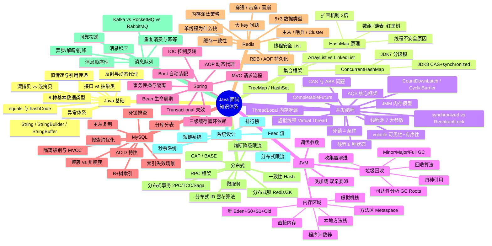
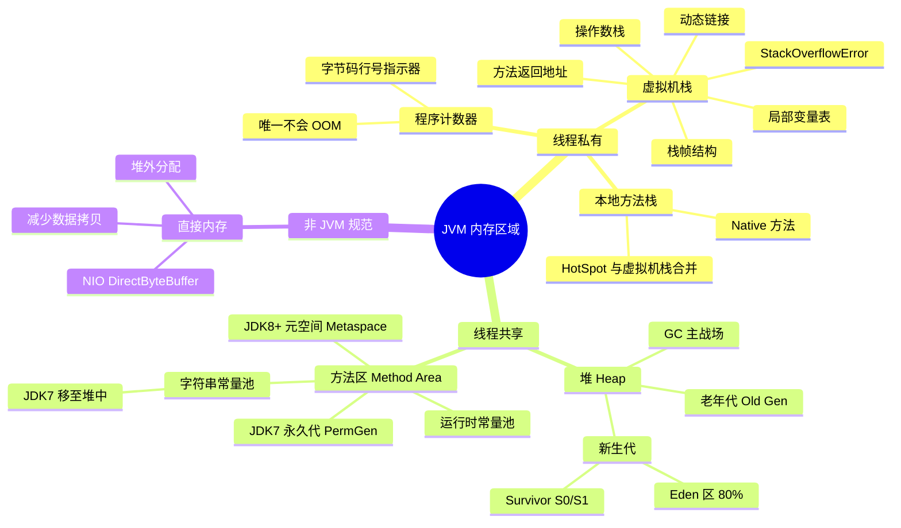
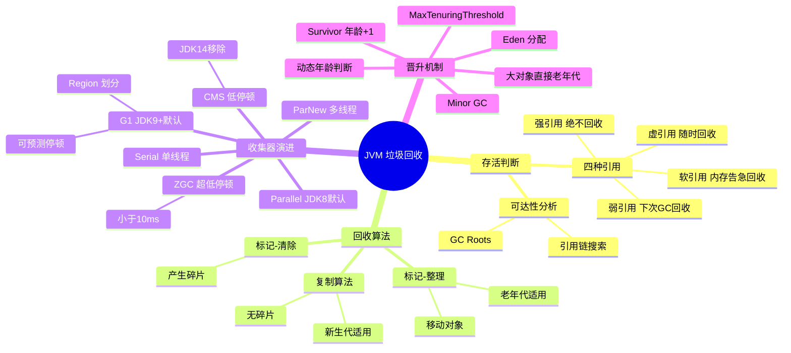

# Java 面试知识脑图

> 共 11 大模块 · 100+ 高频面试题，覆盖初/中/高三个难度层级

## Java 面试知识体系总览

```mermaid
mindmap
  root((Java 面试<br/>知识体系))
    Java 基础
      值传递与引用传递
      String / StringBuilder / StringBuffer
      equals 与 hashCode
      8 种基本数据类型
      接口 vs 抽象类
      深拷贝 vs 浅拷贝
      反射与动态代理
      异常体系
    集合框架
      ArrayList vs LinkedList
      HashMap 原理
        数组+链表+红黑树
        扩容机制 2倍
        线程不安全原因
      ConcurrentHashMap
        JDK7 分段锁
        JDK8 CAS+synchronized
      TreeMap / HashSet
      线程安全 List
    并发编程
      线程 6 种状态
      synchronized vs ReentrantLock
      volatile 可见性+有序性
      JMM 内存模型
      CAS 与 ABA 问题
      AQS 核心框架
      线程池 7 大参数
      CountDownLatch / CyclicBarrier
      ThreadLocal 内存泄漏
      死锁 4 条件
      CompletableFuture
      虚拟线程 Virtual Thread
    JVM
      内存区域
        程序计数器
        虚拟机栈
        本地方法栈
        堆 Eden+S0+S1+Old
        方法区 Metaspace
        直接内存
      垃圾回收
        可达性分析 GC Roots
        四种引用
        回收算法
        收集器演进
        Minor/Major/Full GC
      类加载 双亲委派
      调优参数
    Spring
      IOC 控制反转
      AOP 动态代理
      Bean 生命周期
      三级缓存循环依赖
      Transactional 失效
      Boot 自动装配
      MVC 请求流程
      事务传播与隔离
    MySQL
      B+树索引
      聚簇 vs 非聚簇
      索引失效场景
      ACID 特性
      隔离级别与 MVCC
      慢查询优化
      分库分表
      主从复制
      死锁排查
    Redis
      单线程为什么快
      5+3 数据类型
      RDB / AOF 持久化
      主从 / 哨兵 / Cluster
      穿透 / 击穿 / 雪崩
      缓存一致性
      大 key 问题
      内存淘汰策略
    分布式
      CAP / BASE
      分布式事务 2PC/TCC/Saga
      分布式 ID 雪花算法
      分布式锁 Redis/ZK
      一致性 Hash
      微服务
      熔断降级限流
      RPC 框架
    消息队列
      异步/解耦/削峰
      Kafka vs RocketMQ vs RabbitMQ
      消息顺序性
      重复消费与幂等
      消息积压
      可靠投递
    系统设计
      秒杀系统
      短链系统
      Feed 流
      排行榜
      分布式限流
```

## JVM 内存区域全景图

```mermaid
mindmap
  root((JVM 内存区域))
    线程私有
      程序计数器
        字节码行号指示器
        唯一不会 OOM
      虚拟机栈
        栈帧结构
        局部变量表
        操作数栈
        动态链接
        方法返回地址
        StackOverflowError
      本地方法栈
        Native 方法
        HotSpot 与虚拟机栈合并
    线程共享
      堆 Heap
        新生代
          Eden 区 80%
          Survivor S0/S1
        老年代 Old Gen
        GC 主战场
      方法区 Method Area
        JDK7 永久代 PermGen
        JDK8+ 元空间 Metaspace
        运行时常量池
        字符串常量池
          JDK7 移至堆中
    非 JVM 规范
      直接内存
        NIO DirectByteBuffer
        堆外分配
        减少数据拷贝
```

## JVM 垃圾回收全景图

```mermaid
mindmap
  root((JVM 垃圾回收))
    存活判断
      可达性分析
        GC Roots
        引用链搜索
      四种引用
        强引用 绝不回收
        软引用 内存告急回收
        弱引用 下次GC回收
        虚引用 随时回收
    回收算法
      标记-清除
        产生碎片
      复制算法
        新生代适用
        无碎片
      标记-整理
        老年代适用
        移动对象
    收集器演进
      Serial 单线程
      ParNew 多线程
      Parallel JDK8默认
      CMS 低停顿
        JDK14移除
      G1 JDK9+默认
        Region 划分
        可预测停顿
      ZGC 超低停顿
        小于10ms
    晋升机制
      Eden 分配
      Minor GC
      Survivor 年龄+1
      MaxTenuringThreshold
      动态年龄判断
      大对象直接老年代
```
